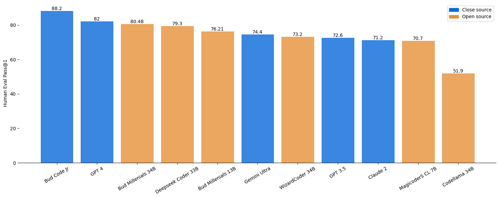

# Bud Code Millenials

Welcome to our Code Model repository! Our model is specifically fine-tuned for code generation tasks. Bud Millenial Code Gen open-source models are currently the State of the Art (SOTA) for code generation, beating all the existing models of all sizes. We have achieved a HumanEval value of 80.48 @ Pass 1, beating proprietary models like Gemini Ultra, Claude, GPT-3.5 etc. by a large margin, and on par with GPT-4 (HumanEval ~ 82. Ref. WizardCoder). Our proprietary model (Bud Code Jr) beats GPT-4 as well with a HumanEval value of 88.2 & a context size of 168K, we will be releasing an API for Researchers, Enterprises, and potential Partners by January 2024 end. If interested, please reach out to jithinvg@bud.studio 


### News 🔥🔥🔥

- [2024/01/03] We released **Code Millenials 34B** , which achieves the **80.48 pass@1** on the [HumanEval Benchmarks](https://github.com/openai/human-eval).
- [2024/01/02] We released **Code Millenials 13B** , which achieves the **76.21 pass@1** on the [HumanEval Benchmarks](https://github.com/openai/human-eval).


### HumanEval

<p align="center" width="100%">
<a ></a>
</p>

For the millenial models, the eval script is used for the above result.

Note: The humaneval values of other models are taken from the official repos of [WizardCoder](https://github.com/nlpxucan/WizardLM), [DeepseekCoder](https://github.com/deepseek-ai/deepseek-coder), [Gemini](https://deepmind.google/technologies/gemini/#capabilities) etc. 


### Models

|   Model | Checkpoint  | HumanEval (+) | MBPP (+) |
|---------|-------------|---------------|----------|
|Code Millenials 34B | <a href="https://huggingface.co/budecosystem/code-millenials-34b" target="_blank">HF Link</a> | 80.48 (75) | 74.68 (62.9) |
|Code Millenials 13B | <a href="https://huggingface.co/budecosystem/code-millenials-13b" target="_blank">HF Link</a> | 76.21 (69.5) | 70.17 (57.6) |


### 🚀 Quick Start

Inference code using the pre-trained model from the Hugging Face model hub

```python
import torch
from transformers import AutoTokenizer, AutoModelForCausalLM

tokenizer = AutoTokenizer.from_pretrained("budecosystem/code-millenials-13b")
model = AutoModelForCausalLM.from_pretrained("budecosystem/code-millenials-13b")

template = """A chat between a curious user and an artificial intelligence assistant. The assistant gives helpful, detailed, and polite answers to the user's questions.
### Instruction: {instruction} ### Response:"""

instruction = <Your code instruction here>

prompt = template.format(instruction=instruction)

inputs = tokenizer(prompt, return_tensors="pt")
sample = model.generate(**inputs, max_length=128)
print(tokenizer.decode(sample[0]))

```

### Gradio Demo

```
python generate.py --base_model "budecosystem/code-millenials-13b"
```

### Important Note

- **Bias, Risks, and Limitations:** Model may sometimes make errors, produce misleading contents, or struggle to manage tasks that are not related to coding.

